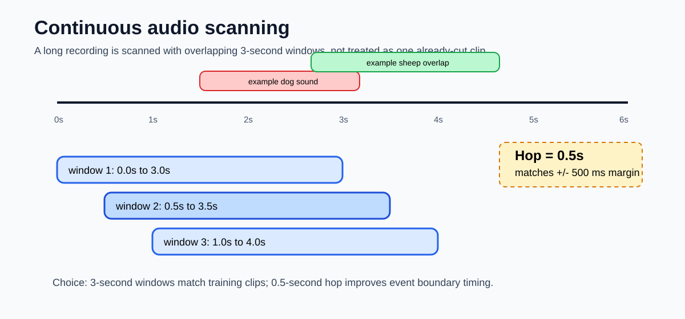

# Slide visuals — data preprocessing

These visuals are meant for the presentation slides. They focus only on the preprocessing choices and the hard parts we need to explain clearly.

## Visual 1 — preprocessing pipeline

Use this when explaining what the preprocessing branch actually does.

Main message:

- We start from class folders.
- We keep the ESC-50 fold number from the filename.
- We convert audio into a fixed `128 x 250 x 3` Log-Mel spectrogram.
- We save fold-based train/validation files for later model training.

## Visual 2 — long audio scanning choice

Use this when explaining why we use a sliding window instead of assuming the audio is already cut into clips.

Main message:

- The final input is one long recording.
- We scan it using 3-second windows.
- We move by 0.5 seconds each time.
- The 0.5-second hop matches the `+/- 500 ms` timing margin in the project.

## Visual 3 — from noisy window hits to cleaner events

Use this when explaining the future event-building logic. This is not model training yet, but preprocessing is designed to support this step.

Main message:

- Raw window detections can flicker.
- Short gaps should often be filled.
- Very short detections should often be removed.
- Silence / low-energy windows help the system avoid false alarms.
- Different animals should be handled independently so overlaps are possible.

## Suggested slide order

1. Show `preprocessing_pipeline.svg` first to explain the branch.
2. Show `sliding_window_scan.svg` to connect preprocessing to the real long-audio problem.
3. Show `event_postprocessing_idea.svg` to explain why the preprocessing metadata matters later.

Keep the explanation simple: “We are preparing the data so the later model and post-processing can handle long audio, overlap, silence, and timing.”